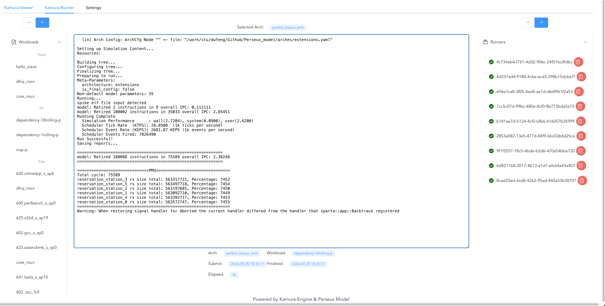
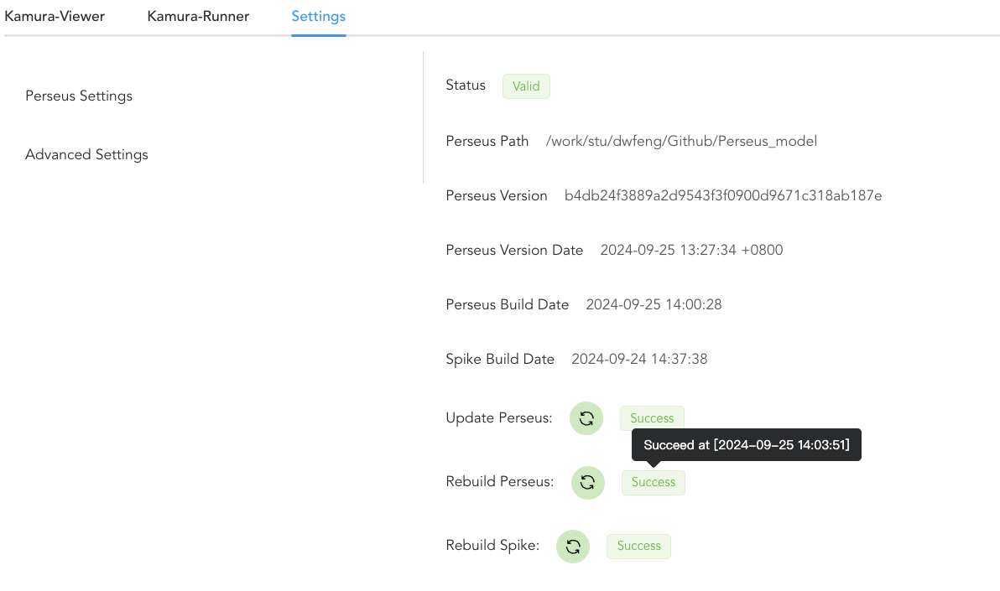

# Kamura

## What is Kamura
The goal of Kamura is to provide a **convenient** & **intuitive** ui for [perseus model](https://github.com/YouqiXia/Perseus_model).


## What's in Kamura's UI
### 1. Kamura Viewer
Kamura View is an interface for viewing and adjusting the architecture, which can create a new architecture, copy architecture, add connections, delete connections, etc.

### 2. Kamura Runner
Runner is a part of Kamura's CI/CD flow, which is used to submit task on running workload of specified architecture you chose in **Kamura Viewer**, each task's info will be recorded and view at any time.

### 3. Kamura Integrator
Integrator is also a part of Kamura's CI/CD flow, it's used to pull the latest Perseus Model from github and check the Perseus Model info (status, build date, commit hash or etc.), and the tedious building process is integrated into one button, which means **press = build**.


## What's in Kamura
In case Kamura is a full webui project, we designed it in traditional C/S model, thus it's divided into 2 parts: **Kamura Engine** & **Kamura Webui**
### 1. Kamura Engine
Kamura Engine is the server to support Kamura's operation, it's written in Rust, divided into 6 parts:
- **kamura**: The main part to run the axum server.
- **kamura-core**: The consts and functions that can be shared by other crates.
- **kamura-integrator**: Supports the integration part, for update & rebuild.
- **kamura-operator**: Supports the viewer part, parse the arch and operate the arch.
- **kamura-runner**: Supports the runner part, for submit task from webui.
- **kamura-controller**: Authorized operations such as flush all database and etc.

### 2. Kamura Webui
Kamura Webui is written in Vue3 framework, split into 3 components: viewer, runner and settings. For the detailed info, check `kamura-webuisrc/components`.

## How to run Kamura
### 1. Run Kamura Engine
#### 1.1 Install rust
Install rust by using command below.
`curl --proto '=https' --tlsv1.2 https://sh.rustup.rs -sSf | sh`

#### 1.2 Run Engine
```sh
## cd engine dir
cd kamura-engine

## run the engine
cargo run --release --bin kamura -- \
--perseus <Perseus model path> \
--redis <redis url> \
--bind <address:port>

# an example is
cargo run --release --bin kamura -- \
--perseus /home/whoami/Github/Perseus_model \
--redis "redis://:testpasswd@127.0.0.1:9876" \
--bind 0.0.0.0:9999

# For debug mode or you want detailed log, add SAYAKA_DEBUG=1 before the command:
SAYAKA_DEBUG=1 cargo run ...
```

### 2. Run Kamura Webui
```sh

cd kamura-webui

## for dev
npm run serve

# for build
npm run build
# you should use Nginx or Apache or sth to deploy the built content
# if you don't know how to do so, google it or use dev mode as former mentioned
```